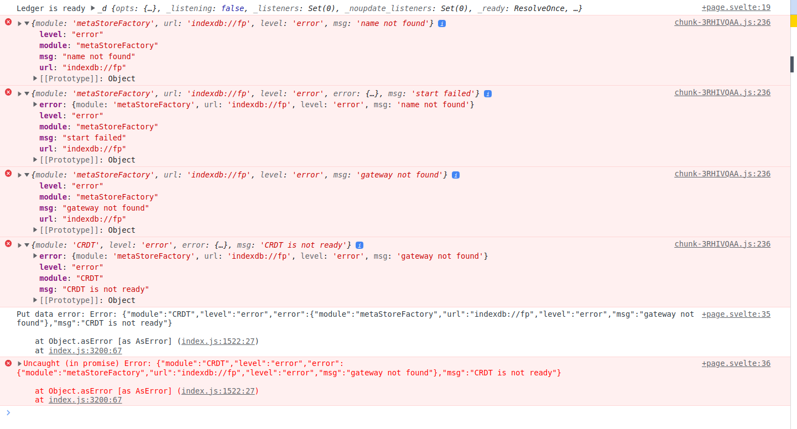

# Capacitor project on Android

Testing Fireproof on a Capacitor project deployed on Android emulator 
with API-33 (using Android Studio).

#### 2024-12-27: Failed  

Good:
- The project can be deployed and the ledger was created without errors.
- So it seems it can run in the Webview (at least works with API-33)

Suspicious:
- I do not see the `fp-keybag` or the ledgers database in the Chrome debugger 
  under Application > Storage > Indexed Db.
- Included creating both LocalStorage keyd and an Indexed Db in the app and 
  they are in fact visible, so Indexed Db permissions seem ok.  

Bad:
- When trying to put data into the ledger it fails with the following 
  exceptions trace:
  

